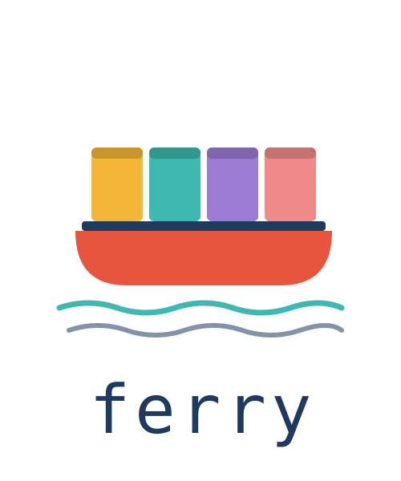

<p align="center">
  
</p>

# Ferry

> **GitHub Actions–native agent pipeline for Jira-driven automated development.**

[](https://github.com/big-emotion/ferry/actions/workflows/ferry-ci.yml)
[](https://opensource.org/licenses/MIT)
[](https://nodejs.org)

```
Jira board  ──▶  repository_dispatch  ──▶  GitHub Actions  ──▶  draft PR
   (you)              (automatic)           (autonomous)        (you merge)
```

Ferry connects your Jira board to a fully autonomous dev loop — Refiner, Developer, Reviewer, and Iterator agents run as GitHub Actions workflows, triggered by column transitions and labels on your Jira tickets.

---

## What Ferry is — and isn't

**Ferry is:**

- A set of GitHub Actions workflows you copy into your repo — no server, no daemon, no infra to own
- An autonomous loop that goes from Jira ticket to reviewed draft PR without you writing a line of code
- Designed for teams that already use Jira + GitHub and want AI-assisted development without leaving those tools

**Ferry is not:**

- A replacement for human review — it opens draft PRs, it never merges
- A general-purpose AI coding assistant — it only acts on explicit Jira column transitions
- Limited to tool-use phases on Anthropic — the Refiner supports all three providers (`anthropic`, `openai`, `google`); the Developer, Reviewer, and Iterator require `anthropic` today (OpenAI/Google agentic-loop support is planned)

---

## Agent phases at a glance

| Phase         | Jira column    | What the agent does                                                                                        |
| ------------- | -------------- | ---------------------------------------------------------------------------------------------------------- |
| **Refiner**   | Refinement     | Reads the ticket, creates sub-tasks, awaits human approval                                                 |
| **Developer** | In Development | Reads approved sub-tasks, opens a draft PR on `ferry/<TICKET-KEY>` (e.g. `ferry/PROJ-42`)                  |
| **Reviewer**  | In Review      | Reads PR diff (green CI only), posts fingerprinted findings                                                |
| **Iterator**  | Iteration      | Applies findings, re-triggers Reviewer (max 3 rounds by default; configurable via `limits.max_iterations`) |

---

## How it works

```
Jira column move / label / @mention
        ↓
  repository_dispatch
        ↓
  gate-envelope (validate)
        ↓
  ┌─────────────┐
  │   Refiner   │  → reads ticket → creates sub-tasks → awaits human approval
  │  Developer  │  → reads sub-tasks → opens draft PR on ferry/<TICKET-KEY> branch
  │  Reviewer   │  → reads PR diff (green CI only) → posts fingerprinted findings
  │  Iterator   │  → applies findings → re-triggers Reviewer (max limits.max_iterations rounds, default 3)
  └─────────────┘
        ↓
  Human merges PR
```

Ferry **never merges** and **rarely moves Jira columns** autonomously. By default, three auto-transitions are enabled:

1. Developer → In Review (FR18)
2. Reviewer → Changes Requested (FR24, on review findings)
3. Iterator → In Review (FR28)

All auto-transitions are configurable via `workflow.agents` in `ferry.config.yaml` — set any to `null` to hand control back to humans, or set custom column names to match your board. See [`docs/CONFIGURATION.md`](docs/CONFIGURATION.md#workflowagents) for details.

---

> ⚠️ **Privacy notice — read before first use.** Ferry transmits the following data to your configured LLM provider(s) (Anthropic by default):
>
> - Jira ticket titles, descriptions, comments, and sub-tasks
> - File contents and diffs from the target GitHub repository
> - Code review feedback and re-prompts
>
> No customer data is stored by Ferry itself, but Anthropic's data-retention policy applies. Review their terms and obtain organisational approval before pointing Ferry at any repo containing confidential code or PII.

---

## Requirements

- GitHub repository (target repo where Ferry runs)
- **GitHub App** installed on the target repo with `contents: write`, `pull-requests: write`, and `issues: write`. The wizard's first step prompts for the App ID and the private-key PEM file — have both ready before running `ferry-init`. (The App is used by `ferry-doctor` to validate the install; the agent workflows themselves run on `${{ github.token }}`.)
- Jira Cloud Standard or Premium (outbound web requests required)
- Anthropic account (required for all phases); OpenAI or Google AI accounts if you configure those providers for the Refiner
- **Story** issue type (and Task, Bug, Spike if your project uses them) must be enabled in the Jira project
- Local tooling: `gh` CLI authenticated against the target repo (`gh auth status`), Node ≥ 20

---

## Quick install

> **Forge:** Ferry runs natively on **GitHub Actions** (production-ready) and on **GitLab CI** (experimental — see [#210](https://github.com/big-emotion/ferry/issues/210)). The wizard targets GitHub; GitLab consumers should copy the templates from [`examples/consumer-setup-gitlab/`](examples/consumer-setup-gitlab) and follow the [GitLab section in `docs/CONFIGURATION.md`](docs/CONFIGURATION.md#gitlab-experimental).

```bash
npx -p @big-emotion/ferry ferry-init
```

The wizard collects your Jira URL, credentials, column status names (prompts with defaults: **Refinement** / **In Development** / **In Review** / **Changes Requested** / **Ready to Merge**), and LLM provider selection per phase. Ferry supports **Anthropic** (default), **OpenAI**, and **Google AI** — see the [provider × phase matrix](docs/CONFIGURATION.md#provider--phase-matrix) for a full breakdown and caveats. Custom status names work — enter them when prompted.

After the wizard finishes, complete four manual steps:

### Step 1 — Create the audit issue

Ferry appends a one-line journal entry to a dedicated GitHub Issue after every agent run:

```bash
gh issue create \
  --repo YOUR_ORG/YOUR_REPO \
  --title "Ferry Audit Log (#1)" \
  --body "Do not close. Ferry writes audit comments here." \
  --label ferry \
  --label "ferry:audit-log:active"
```

Note the returned issue number, then set the variable:

```bash
gh variable set FERRY_AUDIT_ISSUE --body "<issue-number>"
```

### Step 2 — Verify secrets

> **If you ran `ferry-init`**, the wizard already set these six secrets via `gh secret set` (with masked input):
> `FERRY_APP_ID`, `FERRY_PRIVATE_KEY`, `FERRY_JIRA_BASE_URL`, `FERRY_JIRA_EMAIL`, `FERRY_JIRA_API_TOKEN`, `ANTHROPIC_API_KEY`
>
> Verify: `gh secret list --repo YOUR_ORG/YOUR_REPO | grep FERRY` must show all 6 secrets.

**If you skipped the wizard or need to re-set any value**, run the relevant commands manually:

```bash
gh secret set FERRY_APP_ID                --body "<github-app-numeric-id>"
gh secret set FERRY_PRIVATE_KEY           --body "$(cat ferry-app.private-key.pem)"
gh secret set FERRY_JIRA_BASE_URL         --body "https://YOUR-ORG.atlassian.net"
gh secret set FERRY_JIRA_EMAIL            --body "you@example.com"
gh secret set FERRY_JIRA_API_TOKEN        --body "<atlassian-api-token>"
gh secret set ANTHROPIC_API_KEY           --body "<sk-ant-...>"
gh secret set FERRY_REVIEW_TRANSITION_ID  --body "<jira-transition-id-to-in-review>"
gh secret set FERRY_ITER_TRANSITION_ID    --body "<jira-transition-id-to-changes-requested>"
```

### Step 3 — Enable workflow permissions

```bash
gh api -X PUT /repos/YOUR_ORG/YOUR_REPO/actions/permissions/workflow \
  -f default_workflow_permissions=write \
  -F can_approve_pull_request_reviews=true
```

Or via the UI: **Settings → Actions → General → Workflow permissions → Read and write**.

### Step 4 — Connect Jira → GitHub

Create 4 Jira automation rules manually — one per Ferry column. For each rule:

1. **Project Settings → Automation → Create rule** (top-right button)
2. **Trigger:** "Issue transitioned" → set **To status** to the target column (e.g. `Refinement`)
3. **Action:** "Send web request"
   - **URL:** `https://api.github.com/repos/YOUR_ORG/YOUR_REPO/dispatches`
   - **HTTP method:** `POST`
   - **Web request body:** Custom data
   - **Headers** — add all four; toggle the lock icon on `Authorization` to mark it secret:

   | Name                   | Value                         | Secret? |
   | ---------------------- | ----------------------------- | ------- |
   | `Accept`               | `application/vnd.github+json` | No      |
   | `Authorization`        | `Bearer YOUR_GITHUB_PAT`      | **Yes** |
   | `X-GitHub-Api-Version` | `2022-11-28`                  | No      |
   | `Content-Type`         | `application/json`            | No      |

4. **Custom body** (example for the Refiner column):

```json
{
  "event_type": "ferry-refine",
  "client_payload": {
    "version": "v1",
    "event_id": "{{issue.key}}-{{issue.id}}",
    "ticket_key": "{{issue.key}}",
    "phase": "refine",
    "source": "jira-column",
    "ts": "{{now.jiraDate}}",
    "issue_type": "{{issue.issuetype.name}}"
  }
}
```

Set `event_type` and `phase` to `ferry-dev` / `ferry-review` / `ferry-iterate` for the other three columns. Save and **enable** each rule.

> **PAT:** Use a GitHub fine-grained PAT with **Contents: write** on `YOUR_ORG/YOUR_REPO`. Marking `Authorization` as secret keeps the token out of Jira's audit log.

> **Generated reference files:** `ferry-init` writes `ferry-jira-automation-setup.md` (per-rule UI walkthrough) and `ferry-jira-automation-rules.beta.json` into your repo root. The Markdown file mirrors the steps above. The JSON can be loaded via **Automation → ⋮ → Import rules**, but that feature is beta and breaks across Jira Cloud releases — treat it as a reference only.

### SHA pinning (recommended)

Pin the installed stubs to an exact commit SHA rather than the floating tag:

```bash
LATEST_SHA=$(gh api repos/big-emotion/ferry/git/refs/tags/v0.11.0 --jq '.object.sha')
sed -i.bak "s|@v0.11.0|@${LATEST_SHA}|g" .github/workflows/ferry-*.yml && rm .github/workflows/ferry-*.yml.bak
git add .github/workflows/ && git commit -m "chore(ferry): pin to SHA ${LATEST_SHA}"
```

Refresh pinned SHAs every 1–2 months, or configure [Dependabot for GitHub Actions](https://docs.github.com/en/code-security/dependabot/working-with-dependabot/keeping-your-actions-up-to-date-with-dependabot).

### Smoke test

Create a **Story** ticket in Jira and move it to **Refinement**. Within ~5 seconds the `Ferry — Refine` workflow should appear in GitHub Actions. Approve the sub-tasks, move the ticket to **In Development**, and watch the loop: Developer opens a draft PR and auto-transitions the ticket to _In Review_ (FR18); Reviewer runs when CI is green and either marks the PR ready (FR24 — `ferry:approved` label) or transitions to _Changes Requested_ (FR24); Iterator applies findings and transitions back to _In Review_ (FR28).

**Ferry never merges** — you merge the PR yourself when satisfied.

### Operations setup (required)

Add two scheduled maintenance workflows after your smoke test passes:

```bash
# Stale-ticket reconciler — required, runs every 30 min
curl -fsSL "https://raw.githubusercontent.com/big-emotion/ferry/v0.11.0/examples/consumer-setup/workflows/ferry-reconcile.yml" \
  -o ".github/workflows/ferry-reconcile.yml"

# Daily cost check — required, runs at 06:00 UTC
curl -fsSL "https://raw.githubusercontent.com/big-emotion/ferry/v0.11.0/examples/consumer-setup/workflows/ferry-cost-daily.yml" \
  -o ".github/workflows/ferry-cost-daily.yml"

git add .github/workflows/ferry-reconcile.yml .github/workflows/ferry-cost-daily.yml
git commit -m "chore(ferry): add reconciler and cost-daily workflows (required)"
git push
```

Quick install checklist:

```
[ ] Audit issue created + FERRY_AUDIT_ISSUE variable set
[ ] 6 secrets set by ferry-init (verify with: gh secret list | grep FERRY)
    FERRY_APP_ID, FERRY_PRIVATE_KEY, FERRY_JIRA_BASE_URL, FERRY_JIRA_EMAIL,
    FERRY_JIRA_API_TOKEN, ANTHROPIC_API_KEY
[ ] 2 transition-ID secrets set manually (the wizard does NOT set these)
    FERRY_REVIEW_TRANSITION_ID  — Jira transition ID into "In Review"
    FERRY_ITER_TRANSITION_ID    — Jira transition ID into "Changes Requested"
[ ] Workflow permissions = read+write
[ ] 4 Jira automation rules created manually in Jira UI and enabled
[ ] Smoke test passed (ferry-refine green, draft PR opened)
[ ] ferry-reconcile.yml added (required)
[ ] ferry-cost-daily.yml added (required)
[ ] ferry-doctor reports green (npx -p @big-emotion/ferry ferry-doctor)
```

For on-call playbooks (stalled ticket, cost spike, agent-loop runaway, rollback), see [`docs/RUNBOOK.md`](docs/RUNBOOK.md).

For on-demand spend breakdowns, see [`docs/COST.md`](docs/COST.md) — `ferry-cost-report` reads your local `ferry-audit.jsonl` and renders a markdown report with per-phase, per-model, per-ticket, and daily tables plus ASCII sparklines.

---

## Lifecycle commands

| Command                                     | What it does                     |
| ------------------------------------------- | -------------------------------- |
| `npx -p @big-emotion/ferry ferry-init`      | Scaffold Ferry into a new repo   |
| `npx -p @big-emotion/ferry ferry-doctor`    | Diagnose configuration issues    |
| `npx -p @big-emotion/ferry ferry-update`    | Upgrade Ferry to a newer version |
| `npx -p @big-emotion/ferry ferry-uninstall` | Remove Ferry from a repo         |

`ferry-doctor` will warn when a newer version is available:

```
! Ferry update available: v0.4.0 → v0.4.1
  Run `npx -p @big-emotion/ferry@0.4.1 ferry-update` to upgrade
```

See [`MIGRATIONS.md`](MIGRATIONS.md) for consumer-visible changes per release.

---

## Upgrading Ferry

To upgrade the pinned Ferry version in your workflow files without re-entering credentials:

```bash
npx -p @big-emotion/ferry@<new-version> ferry-update
```

Options:

| Flag               | Description                                          |
| ------------------ | ---------------------------------------------------- |
| `--dry-run`        | Print the diff, write nothing                        |
| `--yes`            | Skip confirmation prompt                             |
| `--from <version>` | Override autodetected current version                |
| `--to <version>`   | Target a specific version (default: package version) |

---

## Examples

The canonical agent prompts live in [`prompts/`](prompts/) — that is the single source of truth for each agent's LLM instructions and expected output schema. Consumers can enrich them per project without breaking the Ferry contract by creating `prompts/<agent>.extra.md` files. See [`docs/CONFIGURATION.md`](docs/CONFIGURATION.md) for full customization options.

The [`examples/`](examples/) directory ships reference artifacts you can copy into your install:

- [`consumer-setup/workflows/`](examples/consumer-setup/workflows/) — consumer workflow stubs to copy into `.github/workflows/`
- [`ferry-audit.jsonl`](examples/ferry-audit.jsonl) — sample audit log lines (≥ 20 lines, all phases)

The canonical schemas live in [`src/schemas/`](src/schemas/) (not duplicated here).

---

## Reviewer-grade tool

A small interactive CLI is shipped to grade reviewer output and emit a `reviewer_grade` audit line:

```bash
tsx scripts/ferry-grade.ts <pr-number>
```

It prompts for four integers (Substantive / Specific / Correct / Actionable, each 0–2) and prints one JSON audit line. Verdict thresholds and the **Correct=0 cap** rule are defined in [`scripts/grade.ts`](scripts/grade.ts).

---

## Development

```bash
npm install
npm test          # vitest
npm run typecheck # tsc --noEmit
npm run lint      # eslint
npm run format:check # prettier
```

All gates must pass before opening a PR against `main`.

This project is developed using the [BMad Method](https://github.com/bmadcode/BMAD-METHOD) — an AI-driven agile workflow with structured epics, stories, and agent-assisted implementation.

Ferry was inspired by [OpenAI Symphony](https://github.com/openai/symphony) — an exploration of agentic software development pipelines. Ferry takes the same idea and makes it GitHub Actions–native, Jira-driven, and multi-provider.

See [CONTRIBUTING.md](CONTRIBUTING.md) to contribute.

---

## MCP servers

The Developer and Iterator agents can call **MCP servers** of two kinds, both configured via the `AGENT_MCP_SERVERS` environment variable:

- **HTTP/SSE servers** — proxied through the Anthropic Messages API (beta connector `mcp-client-2025-11-20`). Tool calls execute server-side; no local process is spawned.
- **Stdio servers** — spawned as local subprocesses on the GitHub Actions runner. Ferry manages the process lifecycle and dispatches tool calls client-side.

**Agent coverage:**

| Agent     | MCP support |
| --------- | ----------- |
| Refiner   | No          |
| Developer | Yes         |
| Reviewer  | No          |
| Iterator  | Yes         |

The Refiner runs a single-turn LLM call and the Reviewer uses its own agentic tool loop — neither reads `AGENT_MCP_SERVERS`.

### Default MCP servers

**Context7** (`https://mcp.context7.com/mcp`) is enabled by default for all MCP-capable agents — no configuration required. It gives the Developer and Iterator access to up-to-date library documentation during their agent loops.

To opt out, set the `FERRY_MCP_DEFAULTS_DISABLED` repository variable to `true`. To replace the default Context7 endpoint with your own proxy, add an entry named `"context7"` to `AGENT_MCP_SERVERS` — it will automatically shadow the built-in default.

### HTTP/SSE servers (Anthropic-proxied)

Set the `AGENT_MCP_SERVERS` environment variable (repository variable or secret) to a JSON array with one entry per server:

```json
[
  {
    "name": "context7",
    "url": "https://mcp.context7.com/mcp"
  },
  {
    "name": "github",
    "url": "https://api.githubcopilot.com/mcp/",
    "authorization_token": "<github-fine-grained-pat>",
    "allowed_tools": ["search_code", "get_file_contents"]
  }
]
```

Each HTTP/SSE entry accepts:

| Field                 | Required | Description                                  |
| --------------------- | -------- | -------------------------------------------- |
| `name`                | yes      | Logical name used in prompts and audit logs  |
| `url`                 | yes      | HTTP/SSE endpoint — **must be `https://`**   |
| `authorization_token` | no       | Bearer token forwarded to the MCP server     |
| `allowed_tools`       | no       | Allowlist — only these MCP tools are exposed |
| `denied_tools`        | no       | Denylist — these MCP tools are hidden        |

**Constraints (HTTP/SSE)**

- Tool calls only — MCP prompts and resources are not in scope.
- Only available when the developer agent uses the Anthropic provider; not supported on Bedrock or Vertex.
- Not eligible for Anthropic Zero Data Retention.
- Uses the Anthropic beta connector `mcp-client-2025-11-20`. The API contract may change before GA. The routing logic is covered by unit tests with a mocked Anthropic client; there are no live-network integration tests for this path.

### Stdio servers (client-side)

Stdio MCP servers run as local subprocesses on the GitHub Actions runner. Ferry spawns the process, performs the MCP handshake, and proxies tool calls through it during the agent loop.

```json
[
  {
    "type": "stdio",
    "name": "my-tool",
    "command": "npx",
    "args": ["-y", "@my-org/mcp-server"],
    "env": {
      "MY_API_KEY": "<your-key>"
    },
    "allowed_tools": ["tool_a", "tool_b"]
  }
]
```

Each stdio entry accepts:

| Field           | Required | Description                                                   |
| --------------- | -------- | ------------------------------------------------------------- |
| `type`          | yes      | Must be `"stdio"`                                             |
| `name`          | yes      | Logical name used in prompts and audit logs                   |
| `command`       | yes      | Executable to spawn (must be on `PATH` in the runner)         |
| `args`          | no       | Array of command-line arguments passed to the process         |
| `env`           | no       | Additional environment variables injected into the subprocess |
| `allowed_tools` | no       | Allowlist — only these MCP tools are exposed to the agent     |
| `denied_tools`  | no       | Denylist — these MCP tools are hidden from the agent          |

**Constraints (stdio)**

- The binary named in `command` must be pre-installed (or installable via a `run:` step) in the GitHub Actions runner image.
- Runs entirely client-side — not proxied through the Anthropic API, so Zero Data Retention and Bedrock/Vertex restrictions do not apply.
- Tool calls only — MCP prompts and resources are not in scope.
- Only available when the developer agent uses the Anthropic provider.

**First-party example — context7**

[context7](https://github.com/upstash/context7) serves up-to-date library documentation as an MCP tool. It is **enabled by default** — see [Default MCP servers](#default-mcp-servers) above. No configuration is needed unless you want to opt out or point to a custom proxy.

**End-to-end example — Atlassian for context-rich tickets**

This walkthrough shows how to wire Atlassian's remote MCP server so the Developer loads Confluence pages and linked Jira issues referenced in the ticket before editing code.

**Step 1 — Declare the server in the pool** (`AGENT_MCP_SERVERS` repo variable):

```json
[
  {
    "name": "atlassian",
    "url": "https://mcp.atlassian.com/v1/mcp",
    "authorization_token": "<atlassian-rovo-api-token>",
    "allowed_tools": ["search_confluence", "get_confluence_page", "get_jira_issue"]
  }
]
```

Generate the API token from <https://id.atlassian.com/manage-profile/security/api-tokens>. Use an account with read access to the Confluence spaces and Jira projects you want Ferry to read.

**Step 2 — Map a `ferry:*` label** in `ferry.config.yaml`:

```yaml
labels:
  ferry:mcp/atlassian:
    mcp_servers: [atlassian]
```

**Step 3 — Tell the agent to use it** in `prompts/dev.extra.md`:

```markdown
## Atlassian context

When the ticket description links to a Confluence page or another Jira ticket,
call `atlassian.get_confluence_page` or `atlassian.get_jira_issue` to load
the linked context before planning the change. Skip the tool call when no
such link is present.
```

**Step 4 — Label the Jira ticket** with `ferry:mcp/atlassian` before moving it to _In Development_.

**Failure mode to avoid.** If `prompts/dev.extra.md` does not explicitly instruct the agent to call `atlassian.get_confluence_page` or `atlassian.get_jira_issue`, the Developer may plan the change without ever consulting the linked context — even though the tool is available. MCP tools are passive; the agent must be told when to invoke them.

**Audit logs**

`mcp_tool_use` blocks are logged to stderr as `[ferry:dev-tool] mcp_tool=<name> server=<server>` and reflected in the token-usage counters in the final `[ferry:dev-action]` summary line.

### Per-ticket capability boost via Jira labels

By default, `AGENT_MCP_SERVERS` loads every configured server for **every** ticket. If you want specific tickets to opt into heavy capabilities (e.g. Sentry, Playwright) without inflating the default prompt, declare a `labels:` section in `ferry.config.yaml` (or `.json`):

```yaml
labels:
  ferry:mcp/context7:
    mcp_servers: [context7]

  ferry:mcp/sentry:
    mcp_servers: [sentry]
    tools: [fetch_runtime_logs] # only expose this tool from the Sentry server

  ferry:profile/frontend:
    mcp_servers: [context7, playwright] # profile = curated bundle
```

Then add the matching label to your Jira ticket (e.g. `ferry:mcp/context7`). Ferry unions all matching entries and passes the resulting server list to the agent.

**Security — allowlist is the trust boundary.** Only labels explicitly declared in `ferry.config` are honoured. Any `ferry:*` label on the Jira ticket that is not in the config is logged to stderr and ignored. This prevents anyone with Jira edit rights from pointing Ferry at an arbitrary MCP server.

**Iterator re-reads labels each cycle.** The Iterator agent re-reads labels from Jira at the start of each review→iterate cycle (i.e., each time the iterate workflow runs), not from a stale envelope. If a reviewer or human adds `ferry:mcp/sentry` between iteration 1 and iteration 2, iteration 2 picks it up automatically.

**Backward compatibility.** If the `labels:` section is absent from `ferry.config`, all servers in `AGENT_MCP_SERVERS` are passed through unchanged — existing behaviour is preserved.

See **[docs/MCP.md](docs/MCP.md)** for the full reference: server registry, config schema, per-ticket label scoping, end-to-end Atlassian example, and audit log format.

---

## Cost governance

Ferry is designed for a typical pilot budget: **≤ 200€/provider/month**, **≤ 1.50€ average per story**. Two independent guards apply:

- **Daily spend alert** — `ferry-cost-daily.yml` checks provider usage once a day and posts an alert to the audit issue when spend crosses `FERRY_BUDGET_ALERT_RATIO` of `FERRY_SPEND_CAP_EUR` (default 50% of 200€). This is informational; it does not pause anything.
- **Per-ticket auto-pause** — when an agent receives an HTTP 429 or 402 from the LLM provider mid-run, Ferry applies the `ferry:paused` Jira label so the ticket stops triggering further dispatches until you remove the label. This is independent of the daily alert.

---

## Contributors

| Role                 | GitHub                                   |
| -------------------- | ---------------------------------------- |
| Creator & maintainer | [@jean-noe](https://github.com/jean-noe) |

---

## Star History (lol)

[](https://star-history.com/#big-emotion/ferry&Date)

---

## License

MIT
